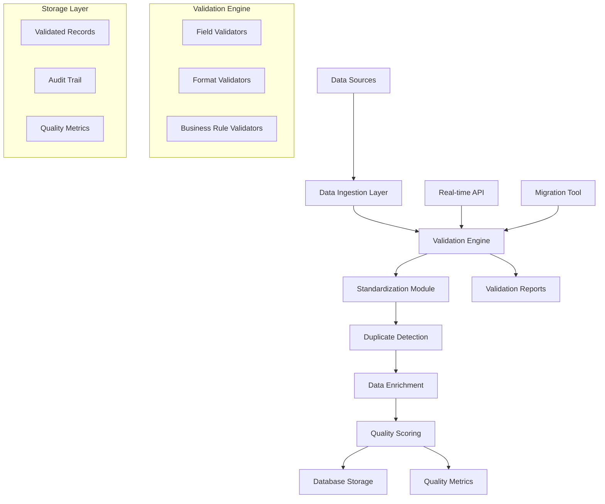

# Design Document - Data Validation Pipeline

## Overview

The Data Validation Pipeline is a comprehensive system designed to ensure high-quality, consistent broker data throughout the Insurance Broker Directory. The system implements a multi-stage validation process that includes data quality checks, format standardization, duplicate detection, enrichment, and real-time validation capabilities.

## Architecture

### High-Level Architecture



### System Components

1. **Data Ingestion Layer**: Handles input from scrapers, APIs, and manual entry
2. **Validation Engine**: Core validation logic with pluggable validators
3. **Standardization Module**: Normalizes data formats and values
4. **Duplicate Detection**: Identifies and merges duplicate records
5. **Data Enrichment**: Fills missing data and corrects errors
6. **Quality Scoring**: Calculates completeness and quality metrics
7. **Reporting System**: Generates validation reports and alerts
8. **Real-time API**: Provides validation services for live data entry

## Components and Interfaces

### 1. Validation Engine

**Purpose**: Core validation logic that processes broker records through multiple validation stages.

**Interface**:
```javascript
class ValidationEngine {
    async validateRecord(record, options = {})
    async validateBatch(records, options = {})
    registerValidator(name, validator)
    getValidationRules()
}
```

**Key Methods**:
- `validateRecord()`: Validates a single broker record
- `validateBatch()`: Processes multiple records efficiently
- `registerValidator()`: Adds custom validation rules
- `getValidationRules()`: Returns current validation configuration

### 2. Field Validators

**Purpose**: Individual validators for specific data fields and formats.

**Validators**:
- `RequiredFieldValidator`: Ensures required fields are present
- `PhoneValidator`: Validates and standardizes phone numbers
- `EmailValidator`: Validates email format and normalizes
- `AddressValidator`: Validates address components
- `SpecialtyValidator`: Validates specialty codes
- `RatingValidator`: Validates rating values and ranges
- `URLValidator`: Validates and corrects website URLs

### 3. Standardization Module

**Purpose**: Normalizes data formats to ensure consistency across all records.

**Interface**:
```javascript
class DataStandardizer {
    standardizePhone(phone)
    standardizeEmail(email)
    standardizeAddress(address)
    standardizeSpecialties(specialties)
    standardizeRating(rating)
}
```

**Standardization Rules**:
- Phone: Convert to (XX) XXXXX-XXXX format
- Email: Lowercase and trim whitespace
- Address: Standardize neighborhood names
- Specialties: Map to standard codes
- Rating: Ensure 0.0-5.0 range with one decimal

### 4. Duplicate Detection Engine

**Purpose**: Identifies potential duplicate records using multiple matching strategies.

**Interface**:
```javascript
class DuplicateDetector {
    async findDuplicates(record, existingRecords)
    calculateSimilarity(record1, record2)
    suggestMerge(duplicates)
    mergeDuplicates(records, strategy)
}
```

**Matching Strategies**:
- Exact match on phone/email
- Fuzzy name matching using Levenshtein distance
- Address similarity comparison
- Combined confidence scoring

### 5. Data Enrichment Service

**Purpose**: Enhances incomplete records by inferring missing information.

**Interface**:
```javascript
class DataEnrichment {
    enrichNeighborhood(record)
    enrichSpecialties(record)
    enrichWebsite(record)
    enrichBusinessHours(record)
}
```

**Enrichment Strategies**:
- Extract neighborhood from address using regex patterns
- Infer specialties from company name/description
- Generate website URLs from business names
- Set default business hours for missing data

### 6. Quality Scoring System

**Purpose**: Calculates completeness and quality scores for broker records.

**Interface**:
```javascript
class QualityScorer {
    calculateCompleteness(record)
    calculateQualityScore(record, validationResults)
    getQualityThresholds()
    categorizeQuality(score)
}
```

**Scoring Criteria**:
- Completeness: Percentage of filled fields
- Accuracy: Validation pass rate
- Consistency: Format standardization compliance
- Enrichment: Auto-corrected field count

## Data Models

### Validation Result Model

```javascript
{
  recordId: "string",
  isValid: boolean,
  completenessScore: number, // 0-100
  qualityScore: number, // 0-100
  validationErrors: [
    {
      field: "string",
      rule: "string",
      severity: "critical|warning|info",
      message: "string",
      suggestedFix: "string"
    }
  ],
  standardizedRecord: {}, // Normalized version
  enrichedFields: ["string"], // Auto-corrected fields
  duplicateMatches: [
    {
      recordId: "string",
      confidence: number, // 0-100
      matchingFields: ["string"]
    }
  ],
  processedAt: "ISO8601 timestamp"
}
```

### Quality Metrics Model

```javascript
{
  totalRecords: number,
  validRecords: number,
  invalidRecords: number,
  averageCompleteness: number,
  averageQuality: number,
  validationRuleStats: {
    "ruleName": {
      passed: number,
      failed: number,
      passRate: number
    }
  },
  duplicatesFound: number,
  duplicatesMerged: number,
  enrichedRecords: number,
  processingTime: number,
  generatedAt: "ISO8601 timestamp"
}
```

### Broker Record Schema (Enhanced)

```javascript
{
  // Core fields
  id: "string",
  name: "string", // Required
  phone: "string", // Required, standardized format
  email: "string", // Required, validated format
  
  // Optional fields
  company: "string",
  website: "string", // Validated URL
  address: "string",
  neighborhood: "string", // Standardized
  city: "string",
  state: "string",
  postal_code: "string",
  specialties: ["string"], // Standardized codes
  rating: number, // 0.0-5.0
  review_count: number,
  description: "string",
  
  // Quality metadata
  completenessScore: number,
  qualityScore: number,
  isValidated: boolean,
  validatedAt: "ISO8601 timestamp",
  enrichedFields: ["string"],
  originalData: {}, // Backup of original values
  
  // Audit trail
  created_at: "ISO8601 timestamp",
  updated_at: "ISO8601 timestamp",
  source: "string",
  lastValidated: "ISO8601 timestamp"
}
```

## Error Handling

### Validation Error Categories

1. **Critical Errors**: Missing required fields, invalid data types
2. **Warning Errors**: Incomplete data, format inconsistencies
3. **Info Errors**: Missing optional fields, enrichment opportunities

### Error Recovery Strategies

1. **Automatic Correction**: Fix common formatting issues
2. **Fallback Values**: Use defaults for missing optional fields
3. **Graceful Degradation**: Continue processing despite non-critical errors
4. **Manual Review Queue**: Flag complex issues for human review

### Error Logging

```javascript
{
  timestamp: "ISO8601",
  level: "error|warn|info",
  recordId: "string",
  validationRule: "string",
  errorMessage: "string",
  originalValue: "any",
  suggestedFix: "string",
  context: {}
}
```

## Testing Strategy

### Unit Testing

- Individual validator functions
- Data standardization logic
- Duplicate detection algorithms
- Quality scoring calculations

### Integration Testing

- End-to-end validation pipeline
- Database integration
- API endpoint functionality
- Batch processing performance

### Performance Testing

- Large dataset processing (1000+ records)
- Real-time API response times (<200ms)
- Memory usage optimization
- Concurrent validation handling

### Data Quality Testing

- Known good/bad data samples
- Edge case handling
- Regression testing with historical data
- Validation rule accuracy measurement

## Performance Considerations

### Optimization Strategies

1. **Batch Processing**: Process multiple records simultaneously
2. **Caching**: Cache validation rules and lookup data
3. **Parallel Processing**: Use worker threads for CPU-intensive tasks
4. **Database Indexing**: Optimize duplicate detection queries
5. **Memory Management**: Stream large datasets to avoid memory issues

### Performance Targets

- Single record validation: <50ms
- Batch processing: 100 records/second
- Real-time API: <200ms response time
- Memory usage: <500MB for 10,000 records
- Database queries: <100ms for duplicate detection

## Security Considerations

### Data Protection

- Sanitize input data to prevent injection attacks
- Validate file uploads and data sources
- Encrypt sensitive data in audit logs
- Implement access controls for validation reports

### API Security

- Rate limiting for validation endpoints
- Authentication for administrative functions
- Input validation for all API parameters
- Secure error messages (no data leakage)

## Monitoring and Alerting

### Key Metrics

- Validation success rate
- Processing throughput
- Error rate by validation rule
- Data quality trends over time
- API response times

### Alert Conditions

- Validation failure rate >10%
- Critical errors detected
- Processing time exceeds thresholds
- API availability issues
- Data quality degradation

## Deployment Strategy

### Development Environment

- Local validation testing
- Sample data processing
- Unit test execution
- Performance profiling

### Staging Environment

- Full pipeline testing
- Production data simulation
- Integration testing
- Performance validation

### Production Environment

- Blue-green deployment
- Gradual rollout
- Monitoring and alerting
- Rollback procedures

This design provides a comprehensive, scalable solution for ensuring data quality in the Insurance Broker Directory while maintaining performance and reliability standards.